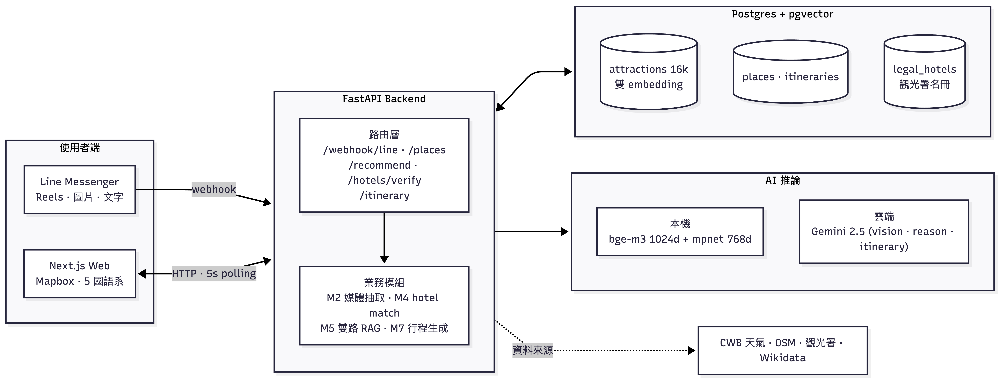
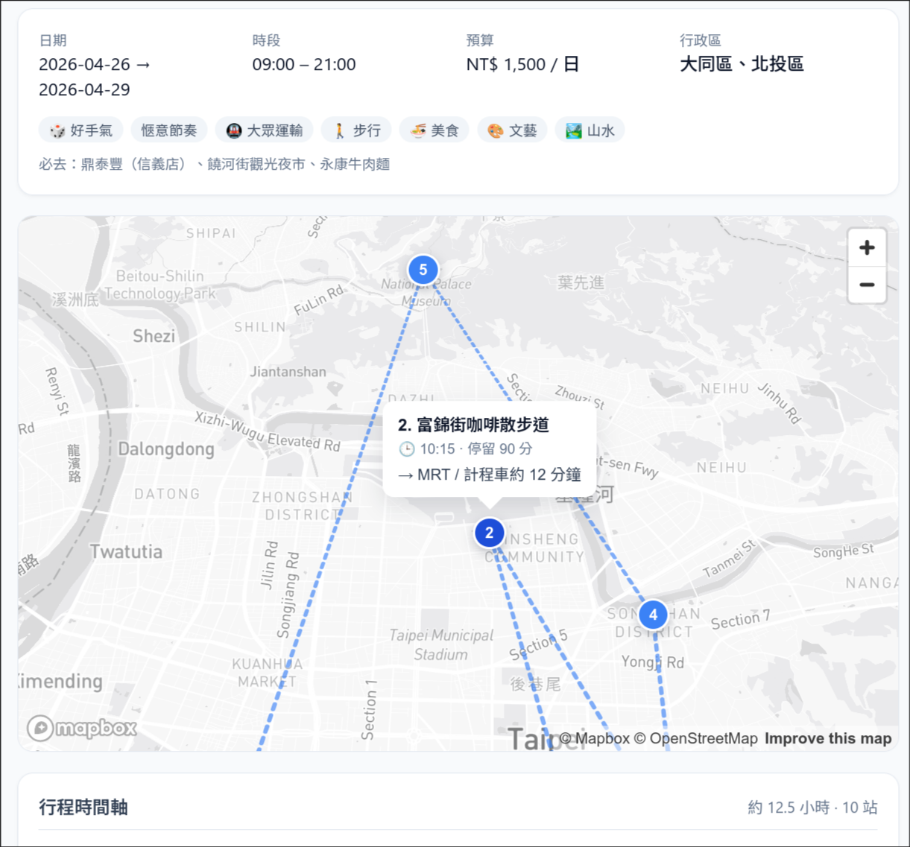
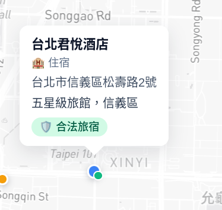

# AzaleaFest — Taipei WanderGuard

> **讓 AI 規劃你的台北行，順手擋下非法旅宿。**

- 賽題 A · ⾏旅台北
- 團隊：第 7 隊 杜鵑花節文宣組

**Topics**: `taipei` `travel` `ai` `rag` `line-bot` `pgvector` `nextjs` `fastapi` `gemini` `embeddings`

---

## 簡介

我們做了一個整合短影音旅遊資訊並自動規劃行程的 AI Line Bot，給 15–35 歲習慣使用 Reels / Threads 搜尋旅遊資訊的族群使用，解決資訊分散、旅遊規劃門檻高，以及住宿資訊缺乏驗證的問題。

## 主要功能：

- 功能 1：短影音行程解析
使用者可上傳 Reels，系統自動解析影片內容並整理出景點與旅遊資訊
- 功能 2：AI 行程整合與推薦
將分散的旅遊資訊整合為完整行程，並推薦相關景點與在地商家
- 功能 3：住宿合法性檢測
自動辨識住宿資訊並檢查其合法性，降低用戶踩雷風險

## 架構圖

## 作品截圖：

1. Line Bot 對話（Reels 傳送）：

2. 網站 UI（暫定）：

3. 行程時間軸：

4. 旅宿守門員：

