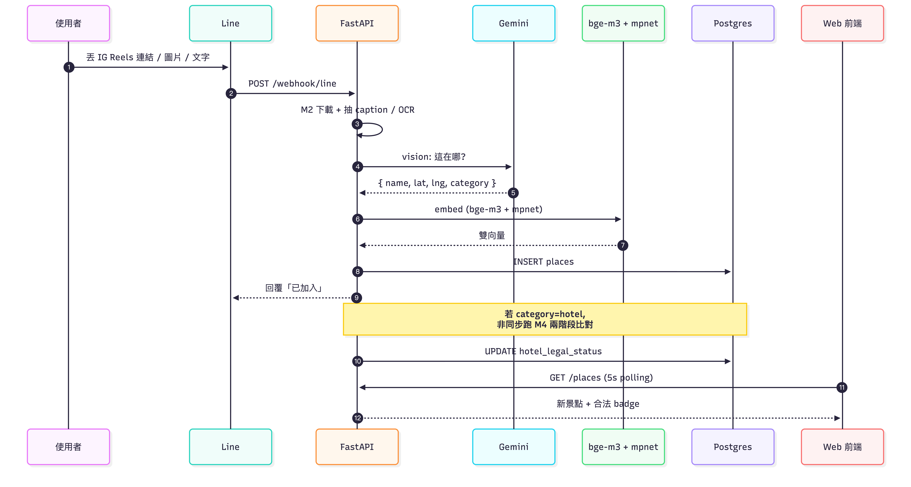
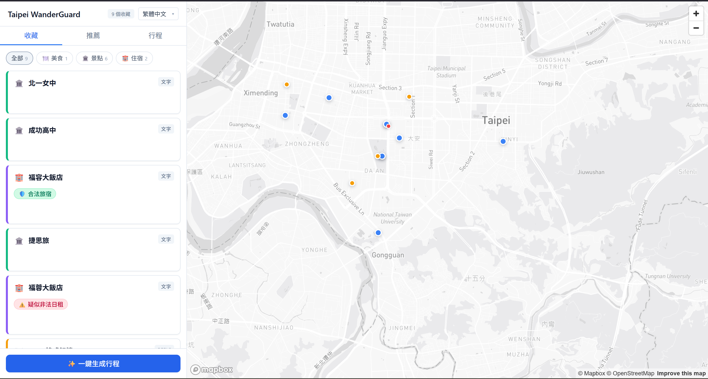

# 台北到不到--一鍵儲存下次一定

[簡報投影片 (PDF)](docs/slides.pdf)

> **讓 AI 規劃你的台北行，順手擋下非法旅宿。**

- 賽題 A · ⾏旅台北
- 團隊：第 7 隊 杜鵑花節文宣組

**Topics**: `taipei` `travel` `ai` `rag` `line-bot` `pgvector` `nextjs` `fastapi` `gemini` `embeddings`

---

## 解決什麼問題

我們做了一個整合短影音旅遊資訊並自動規劃行程的 AI，給 15–35 歲習慣使用 IG Reels / Threads / FB 零散時間搜尋旅遊資訊的族群使用，解決資訊分散、旅遊規劃門檻高，以及住宿資訊缺乏驗證的問題。

## Demo 影片

1. 傳好多影片
https://github.com/user-attachments/assets/2df6fcd6-faaa-46d5-b3de-0bda2a3a0381

2. 累積導致忘記
https://github.com/user-attachments/assets/f00bc798-31e9-474c-a46b-8bab033d5f8b

3. 新增景點
https://github.com/user-attachments/assets/891f1efe-df89-4fdf-9dd7-76a468b51ebd

4. 住宿檢驗
https://github.com/user-attachments/assets/b050c117-30bd-491d-8dc6-a4b92cf77913

5. 生成行程
https://github.com/user-attachments/assets/037b67af-233b-4218-881a-9335410c4aca


## 系統架構




## 作品截圖

1. Line Bot 對話（Reels 傳送）：


2. 網站 UI（暫定）：



3. 行程時間軸：

  

4. 旅宿守門員：


## 快速啟動

```bash
# 1. clone 並進入專案
git clone https://github.com/cy-cheng/AzaleaFest.git AzaleaFest
cd AzaleaFest

# 2. 準備 .env
cp .env.example .env
# 編輯 .env 填入下面這些 key（純前端 demo 可只填 Mapbox）：
#   GEMINI_API_KEY        — M2 影片解析 / M5 推薦 / M7 行程
#   GOOGLE_MAPS_API_KEY   — M3 geocoding / M4 旅宿驗證
#   NEXT_PUBLIC_MAPBOX_TOKEN — 前端地圖
#   LINE_CHANNEL_SECRET / LINE_CHANNEL_ACCESS_TOKEN — 只有要跑 Line Bot 才需要

# 3. 一鍵啟動（DB + backend + redis + frontend）
docker compose up -d

# 4. 串連社群 Agent
# 將後端網址接到對應社群帳號的 webhook
```

## 功能列表

- 功能 1：短影音行程解析
使用者可上傳 Reels，系統自動解析影片內容並整理出景點與旅遊資訊
- 功能 2：AI 行程整合與推薦
將分散的旅遊資訊整合為完整行程，並推薦相關景點與在地商家
- 功能 3：住宿合法性檢測
自動辨識住宿資訊並檢查其合法性，降低用戶踩雷風險

## 技術棧

| 類別 | 用了什麼 | 做什麼用 |
|---|---|---|
| 前端 | Next.js + Mapbox | 網頁與互動地圖 |
| 後端 | FastAPI（Python） | API 服務 |
| 資料庫 | PostgreSQL + pgvector | 存景點、找相似 |
| AI | Gemini 2.5 | 看 Reels 抓景點、寫推薦、排行程 |
| 向量模型 | bge-m3、mpnet | 比對風格相近的景點 |
| Line Bot | Line Messaging API | 訊息收發 |
| 外部資料 | Google Maps、中央氣象署 | 地址定位、當日天氣 |
| 部署 | Docker Compose | 一鍵啟動 |

## 團隊分工

- M0: 陳以哲
- M1: 胡允升
- M2: 鄭竣陽
- M3: 陳亮延
- M4: 陳以哲
- M5: 胡允升
- M6: 陳亮延
- M7: 鄭竣陽
- 使用者體驗搜集分析、簡報：李欣恬
